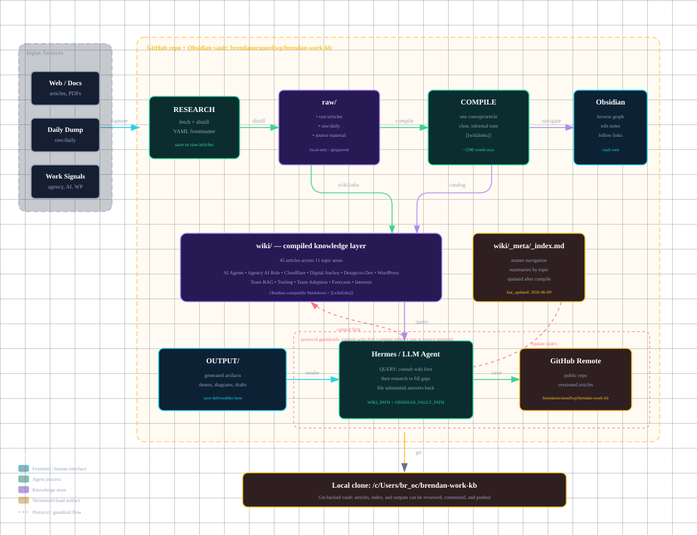

# Brendan's Work KB

A personal knowledge base I've been building while working at the intersection of AI, WordPress, and web agency ops. This is the research and thinking behind what I cover on [YouTube](https://www.youtube.com/@BrendanOConnellWP) and [my site](https://brendan-oconnell.com/).

Not a course. Not a tutorial series. A living wiki that compounds over time — frameworks I actually use, workflows I've actually built, patterns that come from being inside a real agency trying to make this stuff work.

## What's in here

```
wiki/
  ai-agents/        # Agent patterns, evals, design-to-code workflows,
                    # Notion vs Obsidian architecture, agentic commerce
  agency-ai-role/   # What the AI integrator role actually is, first 30 days,
                    # second brain gameplan
  cloudflare/       # Cloudflare AI platform, MCP at scale, Workers as infra
  digital-anchor/   # Digital Anchor positioning, buyer language, offer strategy
  design-to-dev/    # Figma-to-code pipelines, workflow audits, SIPOC, value stream mapping
  forecasts/        # AI scenario forecasts
  interests/        # Case studies worth studying
  team-adoption/    # Getting non-technical teams to actually use AI
  team-rag/         # RAG architecture, access control, ingestion pipelines
  tooling/          # n8n, cold email automation
  wordpress/        # WordPress AI dev patterns, Claude Code, Codex, Figma→WP
```

## How I use it

Articles are written in Obsidian-compatible Markdown with `[[wikilinks]]` between related topics. The goal is density — every article should teach something, not just summarize it.

When I cover a topic on YouTube, the relevant article(s) are usually already in here or get added after. Think of it as the unedited version of the video.

## How the system works

The repo is both a GitHub-backed Obsidian vault and an LLM-readable wiki. The basic loop is:

1. **Research** — collect useful sources, docs, transcripts, or messy notes into `raw/`.
2. **Compile** — turn that raw material into focused wiki articles under `wiki/`.
3. **Connect** — use `[[wikilinks]]` and `wiki/_meta/_index.md` so the knowledge stays navigable.
4. **Query** — ask the agent to consult the wiki first, then do new research only where there are gaps.
5. **Output** — save reusable deliverables, diagrams, drafts, or demos in `output/` when they are useful beyond one session.



There is also an HTML version of the diagram at [`output/second-brain-architecture.html`](output/second-brain-architecture.html).

## Links

- YouTube: [youtube.com/@BrendanOConnellWP](https://www.youtube.com/@BrendanOConnellWP)
- Site: [brendan-oconnell.com](https://brendan-oconnell.com/)
